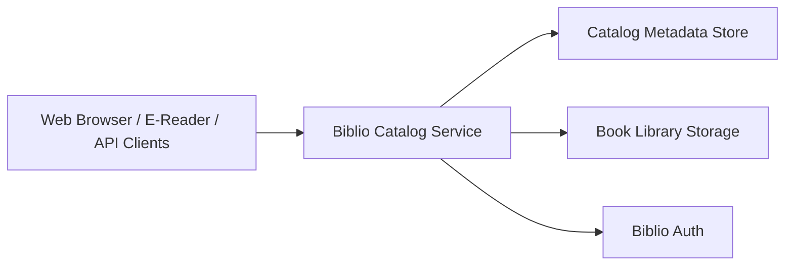

# Biblio Catalog

> Part of the [BiblioHub](https://github.com/vpoluyaktov/biblio-hub) application suite

A Go-based catalog service for e-book discovery, browsing, and OPDS delivery across web and e-reader clients.

## Overview

Biblio Catalog is the library and reading-facing component of the Biblio platform.

Core purpose:

- Provide web and API access to e-book libraries
- Serve OPDS-compatible feeds for e-readers
- Support scalable library import/index workflows
- Integrate with Biblio Auth for centralized access control

## Architecture (High Level)



## Interfaces (Summary)

The service provides:

- Web UI for library navigation and reading workflows
- OPDS endpoints for e-reader clients
- REST APIs for library/book operations
- Authentication integration for protected access

Detailed endpoint contracts and payload examples are maintained in `README.md` and handler code.

## Project Structure (Key Parts)

```
biblio-ebooks-catalog/
├── Specification.md
├── README.md
├── internal/            # server, auth, db, importer, OPDS handlers
├── web/                 # templates and static assets
└── testdata/            # test fixtures and sample datasets
```

## Recent Changes

### 2026-02-18: Cover and Annotation Extraction Migration

**Migrated cover and annotation extraction to unified parser library:**
- Removed duplicate `ExtractFB2Cover()` and `ExtractFB2Annotation()` implementations
- Removed duplicate `GeneratePlaceholderCover()` implementation
- Now uses `biblio-ebook-parser` library for all cover/annotation operations
- Created thin wrapper in `internal/bookfile/extraction.go` for backward compatibility

**Benefits:**
- Eliminates code duplication with audiobook builder
- Single source of truth for cover extraction logic
- Faster extraction using parser library's optimized methods
- Automatic bug fixes when parser library is updated
- Shared cover generation with consistent styling

**Implementation:**
- Wrapper functions in `internal/bookfile/extraction.go`
- Uses `formats/epub` and `formats/fb2` packages for fast extraction
- Uses `cover.GeneratePlaceholder()` for missing cover generation
- Removed old `cover.go`, `cover_generator.go`, and related files

### Unified Ebook Parser Integration (2026-02-17)

Migrated from internal parser implementation to the shared `biblio-ebook-parser` library:

**Benefits:**
- Eliminates code duplication with biblio-audiobook-builder-tts
- Single source of truth for EPUB/FB2 parsing logic
- Easier to add new formats (MOBI, AZW3, PDF)
- Bug fixes apply to all Biblio services
- Element-based content model enables flexible rendering

**Implementation:**
- Added dependency on `github.com/vpoluyaktov/biblio-ebook-parser`
- Created adapter layer in `internal/parser/adapter.go`
- Uses HTML renderer for web reader content
- Maintains backward compatibility with existing API
- Fixed module import paths (biblio-catalog → biblio-ebooks-catalog)

**Architecture:**
```
Parser Library (biblio-ebook-parser)
  ├── EPUB Parser → Element Model → HTML Renderer
  └── FB2 Parser  → Element Model → HTML Renderer
                                        ↓
                            biblio-ebooks-catalog
                            (ExtractContent API)
```

## Current State

**Service status: Operational**

- ✅ Web UI, OPDS, and API surfaces are available
- ✅ Multi-library catalog workflows are in production use
- ✅ Mobile-friendly browsing and reading experience is available
- ✅ Genres UX supports direct nested genre selection, including mobile single-tap flow with context-preserving back navigation
- ✅ Legacy hash-route UI entry points now resolve to the main browser dashboard for consistent navigation
- ✅ Browser dashboard date-column sorting now uses actual date values (not lexicographic string order)
- ✅ Browser dashboard book table includes Series and Series Order columns with sortable values
- ✅ Browser dashboard table columns are resizable and persisted per user in browser local storage
- ✅ Browser dashboard book table header stays sticky while scrolling the books list
- ✅ Integrated with Biblio Auth and BiblioHub routing model

## Development Priorities

1. OPDS evolution and interoperability improvements
2. Reading workflow enhancements and progress synchronization
3. Import/index performance and reliability for large libraries
4. Observability and operational diagnostics improvements

## Contribution Guidance

- Keep this specification high-level and product-focused.
- Keep endpoint tables, env var references, and run/deploy commands in `README.md`.
- Update **Current State** and **Development Priorities** as capabilities change.

## Implementation Progress (Active Work)

### 2026-02-18: OPDS Author and Series Search

**Implemented separate search endpoints for authors and series:**
- Added `SearchAuthors()` and `SearchSeries()` database methods with Cyrillic support
- Created `/opds/{libID}/search/authors?q={query}` endpoint for author name search
- Created `/opds/{libID}/search/series?q={query}` endpoint for series name search
- Updated OpenSearch descriptor to advertise all three search types (books, authors, series)
- Search results include book counts and link to author/series detail pages
- All search endpoints support pagination

**Benefits:**
- E-reader clients can now search for books by author name or series name
- Consistent search experience across all OPDS navigation types
- Cyrillic and Latin character support with case-insensitive matching
- Efficient queries using existing database indexes

**Implementation:**
- Database layer: `internal/db/queries.go` - `SearchAuthors()`, `SearchSeries()`
- OPDS handlers: `internal/server/handlers_opds.go` - `handleOPDSSearchAuthors()`, `handleOPDSSearchSeries()`
- Routing: `internal/server/server.go` - added `search/authors` and `search/series` routes
- OpenSearch: Updated descriptor to include all three search URL templates

### Previous Work

- 2026-02-16: Investigated incorrect chapter list labels in Web Reader (`/catalog/reader`) for EPUB content.
- Root cause identified in reader EPUB chapter-title extraction: parser prioritized HTML `<title>` tags (often identical across files in Project Gutenberg EPUBs) over in-body chapter headings.
- Fix implemented to prefer `<h1>`/`<h2>` chapter headings first, then fall back to `<title>`, then fallback chapter numbering.
- 2026-02-16: Refactored book content extraction into `internal/parser` with format-specific implementations for EPUB and FB2; API content endpoint now uses parser package directly.
- EPUB parser content extraction now supports TOC-driven virtual chapters (including NCX/nav anchor-based slicing for single-file multi-section EPUBs).
- 2026-02-16: Consolidated parser layout by merging shared content types/dispatcher into `parser.go` and merging EPUB/FB2 content extraction into `epub.go` and `fb2.go` (removed separate `*_content.go` files).

---

*Last updated: 2026-02-18*
