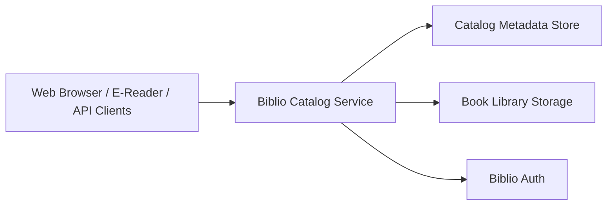

# Biblio Catalog

> Part of the [BiblioHub](https://github.com/vpoluyaktov/biblio-hub) application suite

A Go-based catalog service for e-book discovery, browsing, and OPDS delivery across web and e-reader clients.

## Overview

Biblio Catalog is the library and reading-facing component of the Biblio platform.

Core purpose:

- Provide web and API access to e-book libraries
- Serve OPDS-compatible feeds for e-readers
- Support scalable library import/index workflows
- Integrate with Biblio Auth for centralized access control

## Architecture (High Level)



## Interfaces (Summary)

The service provides:

- Web UI for library navigation and reading workflows
- OPDS endpoints for e-reader clients
- REST APIs for library/book operations
- Authentication integration for protected access

Detailed endpoint contracts and payload examples are maintained in `README.md` and handler code.

## Project Structure (Key Parts)

```
biblio-ebooks-catalog/
├── Specification.md
├── README.md
├── internal/            # server, auth, db, importer, OPDS handlers
├── web/                 # templates and static assets
└── testdata/            # test fixtures and sample datasets
```

## Current State

**Service status: Operational**

- ✅ Web UI, OPDS, and API surfaces are available
- ✅ Multi-library catalog workflows are in production use
- ✅ Mobile-friendly browsing and reading experience is available
- ✅ Integrated with Biblio Auth and BiblioHub routing model

## Development Priorities

1. OPDS evolution and interoperability improvements
2. Reading workflow enhancements and progress synchronization
3. Import/index performance and reliability for large libraries
4. Observability and operational diagnostics improvements

## Contribution Guidance

- Keep this specification high-level and product-focused.
- Keep endpoint tables, env var references, and run/deploy commands in `README.md`.
- Update **Current State** and **Development Priorities** as capabilities change.

---

*Last updated: 2026-02-14*
